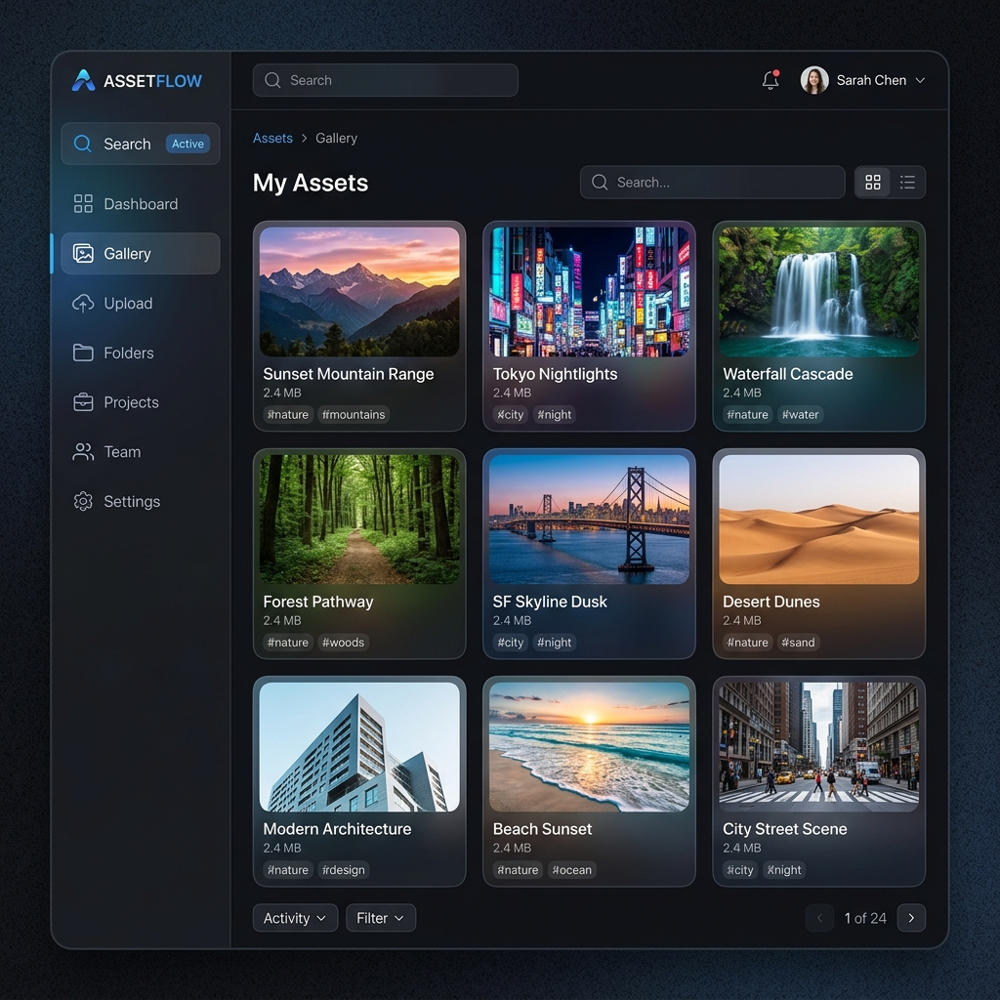
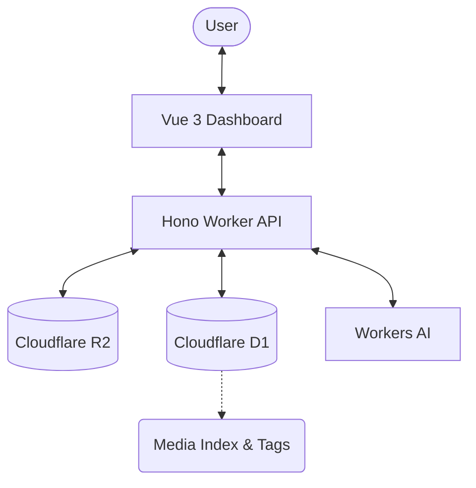
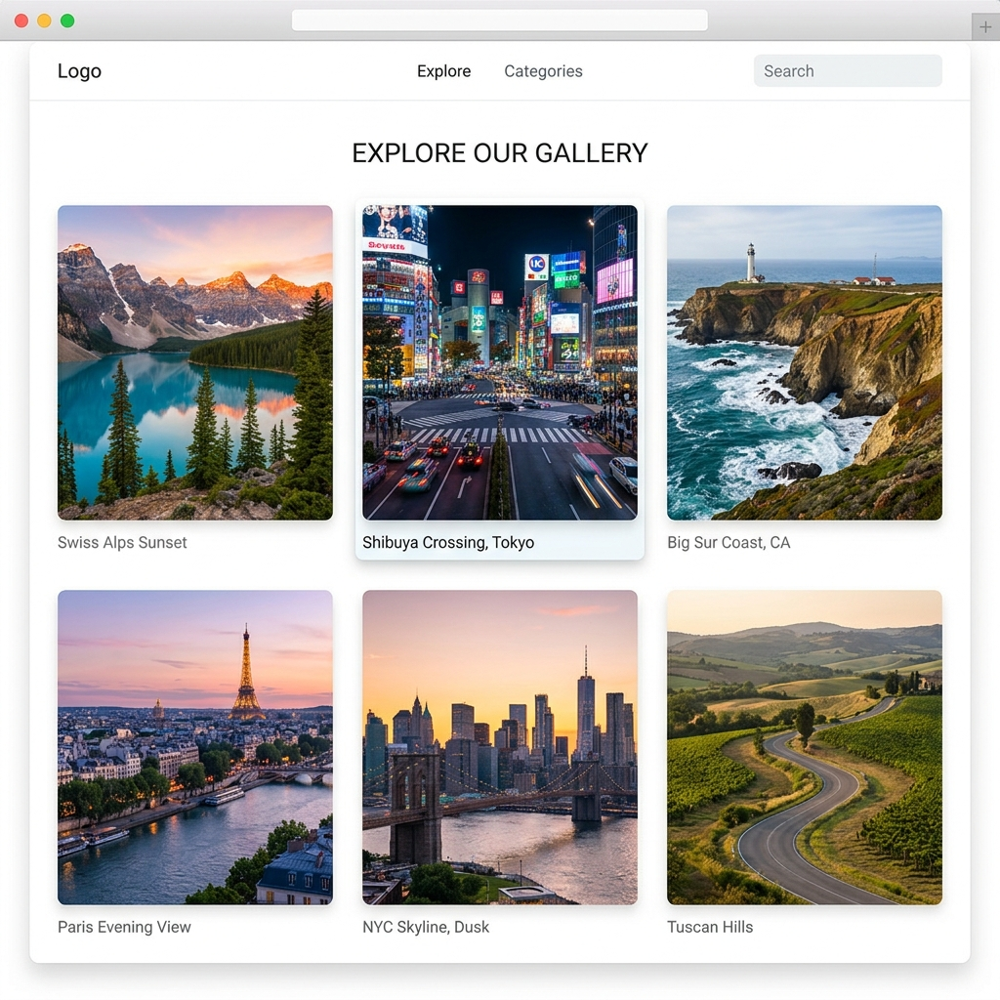
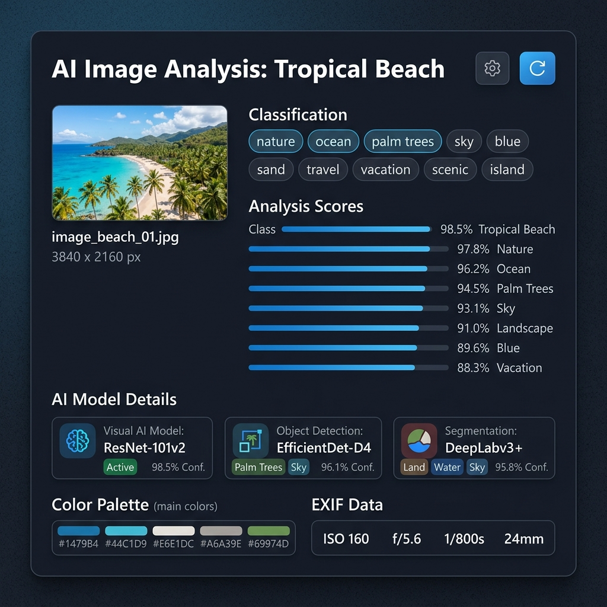

# 🚀 R2E2: Private Asset Management Dashboard

**R2E2** is a high-performance, private asset management dashboard designed for Cloudflare R2. It provides a sleek, Google Drive-like experience for your R2 buckets, enhanced with Workers AI for automatic tagging, image analysis, and advanced search.


*Sleek, responsive, and AI-powered.*

---

## ✨ Features

*   **📦 Multi-Bucket Management**: Browse, upload, and organize files across multiple R2 buckets from a single interface.
*   **🤖 AI-Powered Intelligence**: Automatic image analysis (Vision) and tagging (Llama) to make your media searchable.
*   **🔍 Advanced Search**: Full-text search across all indexed media, filterable by bucket, tag, or file type.
*   **⚡ Frictionless Sharing**: Generate time-limited presigned URLs or permanent public share links via a secure subdomain.
*   **🖼️ Rich Previews**: In-browser previews for images, PDFs, text, markdown, CSV, JSON, audio, and video.
*   **🛠️ Developer First**: Built with Vue 3, Tailwind CSS v4, Hono, and D1.

---

## 🛠️ Quick Start (Local Dev)

Experience R2E2 locally in under 60 seconds without needing Cloudflare credentials.

### 1. Clone & Install
```bash
git clone https://github.com/danielw-sudo/cf-r2e2.git
cd cf-r2e2
pnpm install
```

### 2. Seed Local Data
This will initialize a local D1 database and populate a local R2 bucket with sample images and AI tags.
```bash
pnpm seed:local
```

### 3. Launch
Start the Worker and the Dashboard simultaneously.
```bash
# Terminal 1: Worker API
cd packages/worker && npx wrangler dev

# Terminal 2: Dashboard UI
cd packages/dashboard && pnpm dev
```
Visit `http://localhost:5173` to explore your local R2E2 instance!

---

## 🏗️ Architecture

R2E2 is built on the modern Cloudflare stack for maximum speed and minimal cost.



*   **Frontend**: Vue 3 SPA + Pinia + Tailwind CSS v4.
*   **Backend**: Hono framework running on Cloudflare Workers.
*   **Database**: Cloudflare D1 for fast metadata indexing and search.
*   **Storage**: Cloudflare R2 for reliable object storage.
*   **AI**: Workers AI for on-demand and batch vision analysis.

---

## 📸 Screenshots

### Grid View & Gallery


### AI Metadata & Tagging


---

## 📜 Acknowledgements

This project is a complete refactor of the original [R2-Explorer](https://github.com/G4brym/R2-Explorer) by Gabriel Massadas. We gratefully acknowledge Gabriel for the original work and panel structure design.

## ⚖️ License

MIT License. See [LICENSE](LICENSE) for details.
